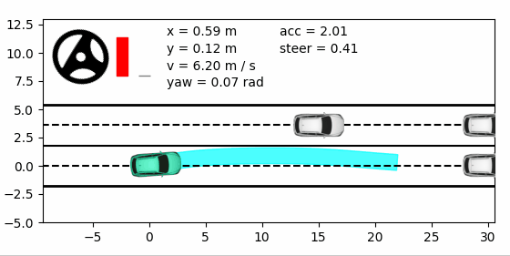
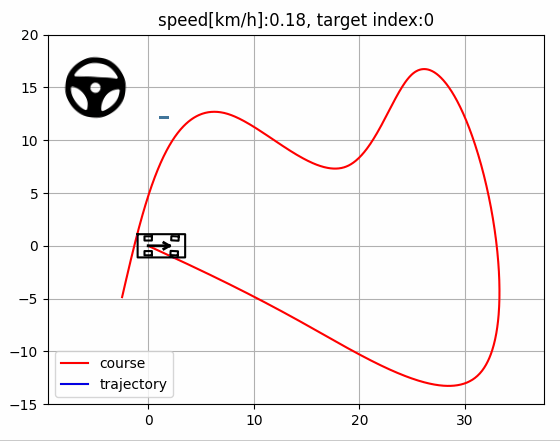
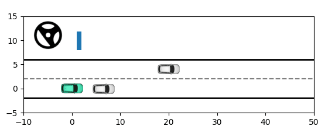

# toy-example-of-iLQR
iterative Linear Quadratic Regulator practice. For more information, see [LQR与iLQR：从理论到实践【详细】](https://zhuanlan.zhihu.com/p/715102938)

**[Done]** *~~Currently, the real-time performance of CI-LQR examples is poor, which will be optimized later.~~*
<div align=center>
  
</div>

## Usage

### 1. mini demo of LQR

```shell
python scripts/0-lqr-demo.py
```
<div align=center>
  
</div>

### 2. path tracking using LQR

```
python scripts/1-lqr-pathtracking.py
```

<div align=center>
  
</div>

### 3. motion planning using CI-LQR

```python
python scripts/2-cilqr-motionplanning.py
```
<div align=center>
  
</div>
