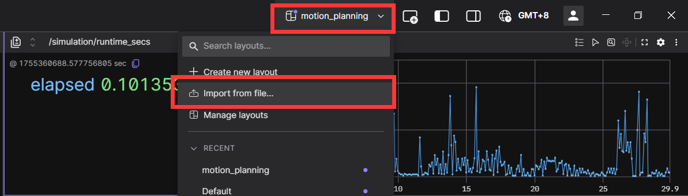
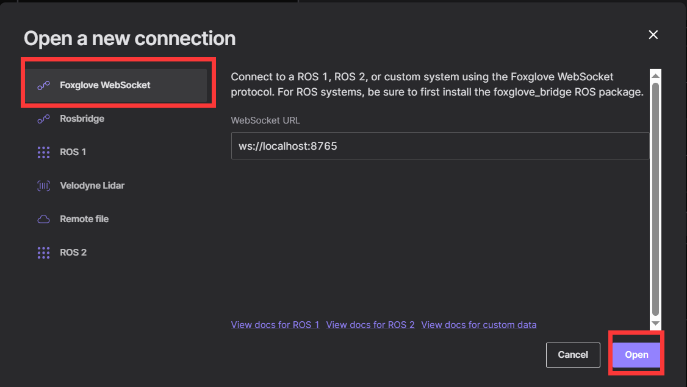
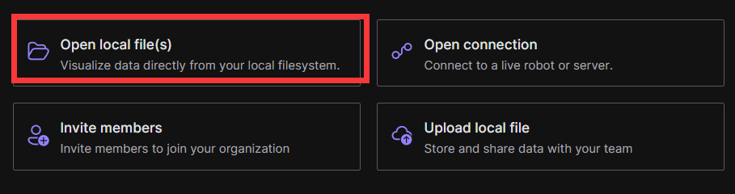

# Foxglove Guide

**Foxglove Studio** is an open-source visualization and debugging tool designed for robotics and autonomous systems. It allows developers to inspect messages, playback data logs, and create custom panels to analyze sensor inputs, vehicle states, and planning outputs. With its modern web-based interface, **Foxglove Studio** helps teams quickly understand and debug complex systems. For more information, refer to its [official website](https://docs.foxglove.dev/docs)


## How to use it

### 1. Preparation

Foxglove is a cross-platform(Linux/Windows/MacOS) application. Download the corresponding version from the [Download Foxglove](https://foxglove.dev/download)  to your local. Alternatively, you can use its [web application](https://app.foxglove.dev/) directly online.

Then, in order to ensure consistent visualization, you need to add the [layout file](./config/motion_planning.json) to your foxglove. Of course, you can also adjust the layout yourself.



### 2. Online connection

Open connection and connect to a live robot or server.



Then execute the executable file to see the real-time visualization.

```shell
./build/motion_planning -c ./config/scenario_three_bend.yaml
```

### 3. Offline playback

The program will save data to the `.mcap` file in the current path by default for playback. Therefore, you can also open local files directly in the foxglove dashboard.

